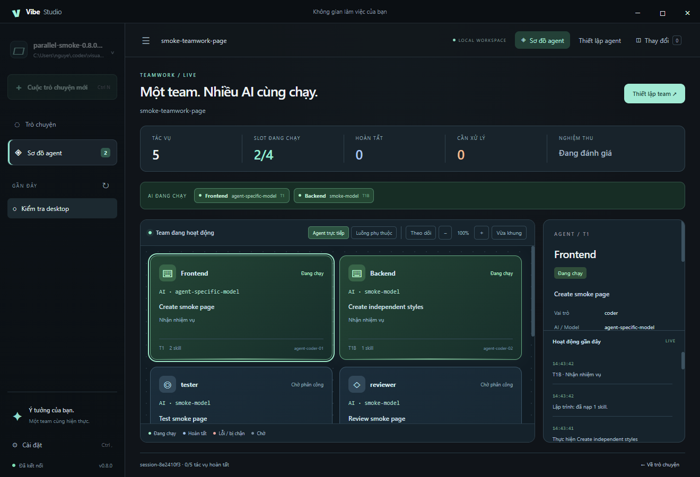

# Vibe Studio 1.0

Không gian làm việc AI trên Windows để trò chuyện với dự án, viết mã và phối hợp nhiều agent. Vibe Studio kết hợp chat, quản lý ngữ cảnh, công cụ lập trình và sơ đồ tác vụ trong một ứng dụng desktop.

[Tải Vibe Studio 1.0](https://github.com/Tungdota53/cutty-studio/releases/tag/v1.0.0) · [Mã nguồn](https://github.com/Tungdota53/cutty-studio)



## Tính năng

### Chat và làm việc với dự án

- Chọn thư mục dự án, tạo chat và mở lại lịch sử đã lưu.
- Nhận phản hồi trực tiếp khi AI đang trả lời; dừng tác vụ ngay trên giao diện.
- Theo dõi tiến độ ngay trong chat: công cụ đang chạy, bước đã xong và lỗi cần xử lý; mở lại phiên để xem các mốc đã lưu.
- Câu trả lời có tiêu đề, danh sách, bảng, màu code và hiệu ứng streaming; sao chép toàn bộ câu trả lời hoặc từng khối code.
- Đọc, tìm kiếm và chỉnh sửa tệp, xem Git diff, chạy lệnh và kiểm thử theo quyền của agent.
- Kết nối nhà cung cấp API tương thích OpenAI bằng URL, khóa API và tên model.

### Teamwork chạy song song

- Phân công công việc cho các agent lập kế hoạch, lập trình, kiểm thử, rà soát và nghiệm thu.
- Agent có nhiệm vụ độc lập chạy đồng thời; số agent đang hoạt động có thể cấu hình từ 1 đến 16.
- Mỗi tác vụ có người phụ trách, tệp được giao, tiêu chí nghiệm thu và quan hệ phụ thuộc.
- Nhánh độc lập tiếp tục khi nhánh khác lỗi; tác vụ cần kết quả còn thiếu hiển thị rõ lý do bị chặn.
- Pipeline lưu kết quả kiểm tra và bằng chứng, hỗ trợ vòng sửa lỗi và kiểm tra lại các bước liên quan.

### Sơ đồ agent trực tiếp

- Hiển thị agent, model đang gọi, nhiệm vụ, bước hiện tại và trạng thái chạy/chờ/hoàn tất/lỗi.
- Xem danh sách agent hoạt động hoặc đồ thị phụ thuộc giữa các tác vụ.
- Bấm tác vụ để xem skill, tệp được giao, kết quả và nhật ký hoạt động.
- Phóng to, thu nhỏ, vừa khung và theo dõi tác vụ đang chạy.
- Giao diện tối với chuyển động và hỗ trợ giảm chuyển động theo hệ điều hành.

### Thiết lập agent và skill

- Chọn model, hướng dẫn, vai trò và skill riêng cho từng agent; bật hoặc tắt agent theo dự án.
- Có 7 skill vai trò và 38 gói skill bổ sung cho lập trình, UI/UX, bảo mật, kiểm thử, nghiên cứu và phối hợp tác vụ.
- Tự đề xuất skill theo vai trò/chủ đề hoặc chọn thủ công.
- Kiểm tra nguồn, giấy phép và tính toàn vẹn của các gói skill đóng sẵn trước khi nạp.
- Đọc tài liệu web HTTPS công khai bằng công cụ nghiên cứu tích hợp.

### Ngữ cảnh và phục hồi

- Lưu lịch sử, lời gọi công cụ và kết quả theo từng cuộc trò chuyện.
- Chế độ tự động dùng cửa sổ context do nhà cung cấp công bố; có giới hạn thủ công/dự phòng khi API thiếu metadata.
- Context dự phòng mặc định **131.072 token**; bảng ngữ cảnh phân biệt cửa sổ hiệu lực, ngân sách đầu vào và phần dành cho đầu ra. Lịch sử hiển thị dung lượng thực tế đã dùng trong phiên.
- Hiển thị dung lượng ước tính, token đầu vào/đầu ra và số lần nén; hỗ trợ nén thủ công.
- Nén lịch sử cũ khi cần, giữ yêu cầu và tra cứu lại bản ghi gốc của tác vụ.
- Đặt ngân sách lượt suy luận và lượt công cụ về **0** để không giới hạn số lượt; nút Dừng và kiểm tra lặp không tiến triển vẫn hoạt động.
- Khi stream bị ngắt, tiếp tục trên cùng model với tối đa hai lần phục hồi; giữ checkpoint và loại bỏ lời gọi công cụ chưa hoàn chỉnh.

### Kết nối nhiều MCP

- Thêm nhiều server trong mục **MCP**, hỗ trợ Streamable HTTP và chương trình Stdio chạy trên máy.
- Xem trạng thái kết nối và số công cụ của từng server; bật/tắt hoặc xóa từng cấu hình.
- Agent tự thấy và gọi các công cụ được phép, với tên riêng theo server để tránh trùng.
- Các agent chạy song song có thể dùng nhiều server đồng thời; lỗi của một kết nối được giữ riêng.
- Công cụ MCP được lọc theo vai trò và tính chất chỉ đọc. Tác vụ ghi không tự được gửi lại khi lỗi kết nối.

## Tải và bắt đầu

Mở [trang tải Vibe Studio 1.0](https://github.com/Tungdota53/cutty-studio/releases/tag/v1.0.0), chọn bản dành cho **Windows x64**:

| Tệp | Cách dùng |
| --- | --- |
| `Vibe-Studio-1.0.0-x64-Setup.exe` | Cài đặt ứng dụng và tạo shortcut |
| `Vibe-Studio-1.0.0-x64-Portable.exe` | Chạy trực tiếp, không cần cài đặt |
| `SHA256SUMS-1.0.0.txt` | Đối chiếu checksum của các tệp tải xuống |

1. Mở ứng dụng và chọn thư mục dự án.
2. Vào **Cài đặt**, nhập URL API, khóa API và tên model của nhà cung cấp.
3. Chọn context tự động hoặc nhập giới hạn thực tế của model.
4. Trò chuyện trực tiếp hoặc chọn **Teamwork** để giao việc cho nhóm agent.
5. Mở **Thiết lập agent** để chỉnh model, skill và số agent chạy đồng thời.

Ứng dụng đi kèm runtime nên không cần cài Node.js để mở app. Dự án vẫn cần các công cụ tương ứng như Git, npm hoặc Python khi tác vụ sử dụng chúng. Khóa API được mã hóa bằng Windows khi hệ thống hỗ trợ; nếu không, khóa chỉ giữ trong phiên làm việc.

## Phím tắt

| Phím | Chức năng |
| --- | --- |
| `Ctrl + N` | Tạo chat mới |
| `Ctrl + ,` | Mở cài đặt |
| `Enter` | Gửi yêu cầu |
| `Shift + Enter` | Xuống dòng |

## Phát triển từ mã nguồn

Yêu cầu Node.js 22.12 trở lên để phát triển và đóng gói desktop.

```powershell
npm install
npm run desktop
```

```powershell
npm test
npm run desktop:pack
```

Bản Setup và Portable được tạo trong thư mục `release`. Cấu hình nhóm agent lưu theo dự án tại `.vibe/config.json`; lịch sử và dữ liệu phiên nằm trong `.vibe`.

## Lưu ý khi sử dụng

- Context và đầu ra vẫn chịu giới hạn thực tế của model/nhà cung cấp. Số token ước tính không thay thế số liệu tính phí của API.
- Phiên lỗi hoặc phiên đang chạy khi đóng app không tự thực thi lại các lệnh ghi tệp khi mở lại.
- Các thay đổi trong worktree cần được kiểm tra và tích hợp vào nhánh dự án.
- Chỉ cấp quyền thực thi lệnh và sửa tệp cho agent trong dự án bạn tin cậy. Lệnh nguy hiểm cần phê duyệt.
- Bản Windows hiện chưa có chữ ký số nhà phát hành.

Giấy phép và thông tin nguồn của các skill được giữ cùng từng gói trong `src/vendor-skills`.
