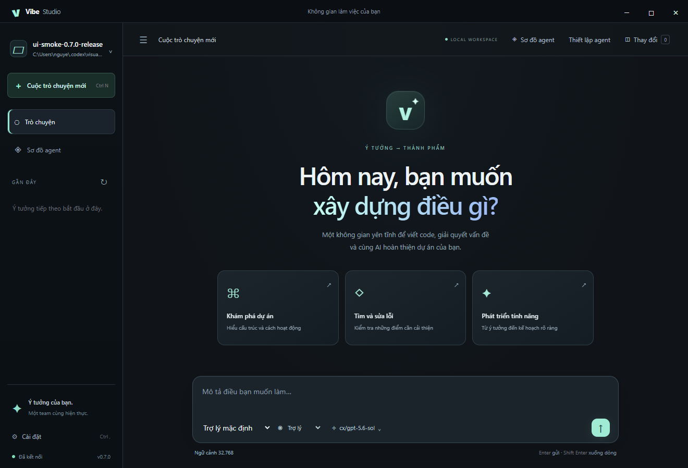
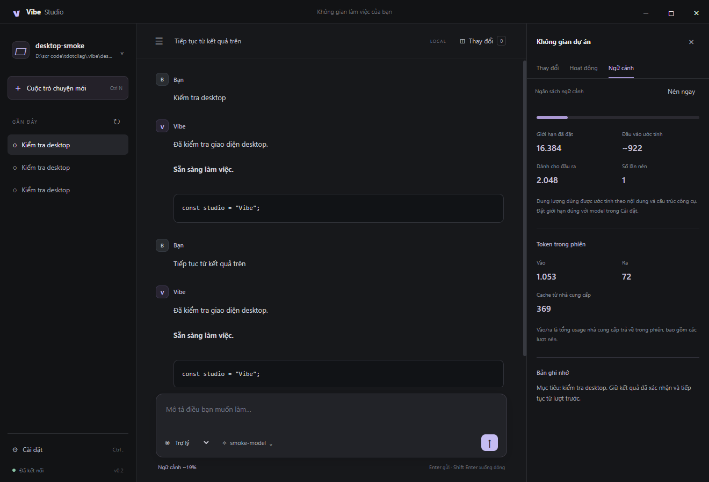

# Cutty Studio / Vibe Studio

Ứng dụng desktop Windows cho coding với API tương thích OpenAI, chat streaming, ngữ cảnh bền vững và teamwork nhiều agent. Mã nguồn: [Tungdota53/cutty-studio](https://github.com/Tungdota53/cutty-studio).

## Context và phản hồi công cụ — 0.10.2

- Giữ nguyên các chỉ dẫn ngắn ở giữa hội thoại khi nén; `recall_context` đọc lại bản ghi gốc của chính tác vụ với tìm kiếm và phân trang.
- Bước tóm tắt chỉ gọi provider một lần, giới hạn 30 giây. Chặn stream rỗng, phản hồi bị cắt, JSON công cụ lỗi và ID trùng trước khi thực thi.
- Không fallback sau stream đã phát dữ liệu một phần; kiểm tra ngân sách cả batch công cụ trước khi ghi file. Model routing tôn trọng cấu hình hiệu lực và loại ID trùng.
- 289/289 kiểm thử đạt trên 21 tệp. [Chi tiết và giới hạn](docs/context-recovery.md).

## Sửa phục hồi context — 0.10.1

- Nén được các lượt gọi công cụ lớn đã hoàn tất; giữ nguyên yêu cầu đầu/cuối, không chạy lại thao tác ghi file. Khi model tóm tắt lỗi/rỗng, dùng trích đoạn dự phòng có nhãn và báo rõ trên giao diện.
- Skill được nạp theo ngân sách model; bàn giao tính cả metadata và Unicode. Planner dùng danh mục skill liên quan thay vì chèn toàn bộ thư viện.
- Kế hoạch giao lệnh shell cho role chỉ đọc phải được sửa trước khi chạy. Pipeline phân biệt lỗi gốc với các tác vụ chưa chạy do bị chặn.
- Giới hạn, cơ chế và kiểm chứng: [docs/context-recovery.md](docs/context-recovery.md). Context vượt giới hạn chỉ bởi yêu cầu/chỉ dẫn bắt buộc vẫn được báo lỗi, không âm thầm cắt yêu cầu.

## Pipeline Teamwork có bằng chứng — 0.10.0

- Sơ đồ theo dõi mức chạy song song cao nhất, model thực tế, tool calls, kiểm tra đạt/trượt, tiêu chí, plan diagnostics và hai vòng sửa tối đa. Bấm thanh **Pipeline** để xem lưu ý, lịch sử repair, lệnh kiểm tra và trích đoạn bằng chứng.
- Mỗi phiên ghi checkpoint `pipeline.json` và lifecycle `events.jsonl`; mở lại lịch sử đọc cùng báo cáo. Thông tin nhạy cảm phổ biến được redact trước khi lưu báo cáo pipeline.
- Khi nhiều tester/reviewer cùng phát hiện lỗi, đợi tất cả dừng rồi gom finding vào một repair. Chỉ gate hạ nguồn bị ảnh hưởng được chạy lại; các nguồn gốc và công việc triển khai đã hoàn tất được giữ nguyên.
- Chặn hai Teamwork chạy chồng trong cùng workspace trên một tiến trình. Ưu tiên task có nhiều bước phụ thuộc phía sau, giữ số slot và khóa sở hữu file.
- Tài liệu thiết kế và giới hạn ở [docs/team-pipeline-engineering.md](docs/team-pipeline-engineering.md). Báo cáo hỗ trợ kiểm tra và khôi phục UI; app chưa tự replay shell/write side effects sau khi tiến trình đóng.
- Nâng Vitest lên 4.1.11 để xử lý cảnh báo dependency mức vừa. `npm audit` hiện không báo lỗ hổng; production dependencies cũng sạch. Build TypeScript đạt. Chưa chạy lại bộ test sau lần nâng cấp pipeline này.

## Phục hồi planner và điều phối — 0.9.0

- Sửa lỗi `acceptanceCriteria: expected array, received string`: chuỗi đơn được chuyển thành một phần tử, giữ nguyên nội dung. Giới hạn là 30 tiêu chí, mỗi tiêu chí tối đa 1.000 ký tự. Các danh sách command, dependency, file và skill cũng được chuẩn hóa; dữ liệu sai kiểu vẫn bị chặn.
- Đọc JSON có code fence và dấu ngoặc trong chuỗi. Từ chối đầu ra bị cắt hoặc chứa nhiều kế hoạch để planner sửa lại.
- Planner tự sửa tối đa hai lần khi kế hoạch sai schema, dependency, role/phase hoặc agent. Giữ lịch sử/context và lưu từng đầu ra trong `plan-attempt-N.json`; giao diện báo lần sửa và trường bị lỗi. Lỗi API/khóa truy cập không bị lặp lại bởi cơ chế sửa kế hoạch.
- Scheduler ưu tiên nhánh có chuỗi phụ thuộc còn lại dài hơn, theo số task. Đây là ước lượng, không dự đoán thời gian gọi model. Giữ nguyên giới hạn số agent, khóa ghi file và điều kiện nguồn ổn định cho kiểm thử/review.
- Cập nhật task bị chặn theo đồ thị phụ thuộc, kể cả khi planner trả task không theo thứ tự. Phân biệt phiên bị hủy và thất bại; lưu trạng thái kết thúc khi lỗi checkpoint, đồng bộ sơ đồ và chặn chạy chồng trên cùng một orchestrator.
- Planner lưu đúng model thực tế khi fallback. Có thể bắt đầu phiên mới sau khi hủy mà không mang theo task/controller cũ.

Đã kiểm tra: 245 test tự động; luồng desktop với API giả lập trả kế hoạch sai lần đầu rồi sửa, chạy hai worker cùng lúc và đạt gate PASS; kiểm tra runtime đóng gói và khởi động EXE được thực hiện riêng.

Cài bản EXE mới rồi gửi lại yêu cầu trong phiên Teamwork mới. Phiên đã lỗi trước khi nâng cấp không tự chạy tiếp.

Dự án web giới thiệu Việt Nam đã yêu cầu nằm tại [examples/vietnam-discovery](examples/vietnam-discovery/README.md), chạy riêng bằng `npm start` trong thư mục đó.

## Agent chạy đồng thời — 0.8.0

Scheduler dùng pool liên tục: task độc lập ở các pha khác nhau nhận slot ngay khi có chỗ trống, không đợi hết một batch. Worker có tệp riêng chạy song song; các tester/reviewer độc lập cũng chạy cùng lúc trên nguồn ổn định. Planner được hướng dẫn tạo các nhánh fan-out/fan-in, với test writer và worker cùng triển khai sau hợp đồng chung.

- **Agent trực tiếp** là chế độ sơ đồ mặc định: thẻ lớn, tên agent, AI/model đang gọi, nhiệm vụ, bước hiện tại và lý do chờ. Thanh **AI ĐANG CHẠY** hiện tất cả model đang hoạt động; số slot hiển thị `đang chạy / giới hạn`.
- **Luồng phụ thuộc** giữ DAG để xem nhánh song song và điểm hội tụ. Model thực tế, kể cả fallback, được cập nhật theo từng lần gọi và lưu trong task.
- Chỉ chờ khi có dependency thật, trùng quyền ghi tệp, cần nguồn ổn định để kiểm tra hoặc hết slot. Sửa lỗi chờ các validator đang chạy kết thúc, rồi vô hiệu hóa bằng chứng và chạy lại kiểm tra liên quan.
- **Thiết lập agent** cho phép chọn 1–16 slot, 8–200 lượt suy luận và 16–2.000 lượt công cụ/task. Mặc định tăng từ 20/50 lên 64/192. Bốn vòng đọc cùng kết quả kích hoạt nhắc tiến triển; tám vòng liên tiếp dừng với nguyên nhân cụ thể và giữ context. Đây không phải tự chứng minh hoặc tự hoàn tất một agent bị kẹt.

Kiểm tra desktop xác nhận hai model có request cùng lúc; kiểm tra scheduler xác nhận task tiếp theo bắt đầu khi worker khác vẫn chạy, sibling test/review chạy đồng thời và repair không đua với validator.


## Giao diện và sơ đồ agent — 0.7.0

Giao diện mới dùng nền tối xanh, điểm nhấn mint, chuyển động cho card/panel/dialog, trạng thái chạy và đường nối tác vụ. Tự tắt animation và cuộn mượt khi hệ điều hành bật giảm chuyển động.

- **Sơ đồ agent**: xem DAG phụ thuộc, các pha, số tác vụ chạy/hoàn tất/lỗi và gate nghiệm thu từ backend thật. Phiên mới tự mở sơ đồ; nút **Về trò chuyện** giúp quay lại chat.
- Bấm tác vụ để xem agent, model, skill, dependency, tệp được giao, bước hiện tại và kết quả/lỗi. Có nhật ký trực tiếp, phóng to/thu nhỏ, vừa khung và bật/tắt theo dõi tác vụ đang chạy.
- Tải lại giao diện phục hồi trạng thái phiên hiện tại. Mở phiên Teamwork trong lịch sử phục hồi các tác vụ và gate đã lưu; phiên dở dang không được trình bày như đang chạy trực tiếp. Việc này không tự chạy lại scheduler sau khi thoát app.
- Bố cục tự điều chỉnh theo chiều rộng cửa sổ. Tác vụ và đường nối chỉ được tạo từ kế hoạch/sự kiện thật; màn hình chưa chạy hiển thị roster đã cấu hình.


## Quy trình Teamwork theo mẫu Anti — 0.6.0

Đã đối chiếu 111 tài liệu của 25 agent trong mẫu dự án và tài liệu chính thức Antigravity; tổng hợp tại [Quy trình Teamwork](docs/anti-teamwork-protocol.md). App bổ sung **Backend Spec Miner, UI Spec Miner và Final Victory Auditor**, nâng roster mặc định lên **15 agent** với model riêng.

- Task có phase, acceptance criteria, verification commands và ownership rõ. Worker có tập tệp rời nhau được chạy song song trong **một worktree của phiên**; tester/reviewer/auditor kiểm tra chính bản mã đó.
- Gate cần tất cả reviewer liên quan và mọi challenger/auditor đã lập kế hoạch đạt. Kết quả thất bại có quyền veto; thiếu bằng chứng giữ UNVERIFIED. Auditor dùng context mới và không nhận verdict cũ.
- Lỗi test/gate có thể tạo repair task trong phạm vi source đã giao, tối đa hai vòng. Các kiểm tra phụ thuộc chạy lại bằng agent/context mới; không tái sử dụng bằng chứng trước khi sửa.
- Briefing/checkpoint, heartbeat, handoff năm phần, handoff JSON, bảng gate và ma trận tiêu chí được lưu trong `.vibe/sessions`. Hash theo tệp khai báo phát hiện nguồn thay đổi và bằng chứng mất hiệu lực.
- Sửa ghi tệp vào các thư mục cha chưa tồn tại, đồng thời giữ kiểm tra traversal/symlink.

Dự án đã lưu roster: **Thiết lập agent → Thêm team chuyên môn → chọn model → Lưu phân vai**. Tiêu chí bằng ngôn ngữ tự nhiên vẫn cần reviewer/judge đối chiếu; chưa có sandbox shell theo tệp, tự merge worktree hoặc tự tiếp tục scheduler sau khi tắt app.

## Team chuyên môn và thư viện skill — 0.5.0

Teamwork áp dụng cách giao việc có briefing, phạm vi tệp, dependency, tiến độ và handoff riêng cho từng agent. Bộ mặc định có 12 agent trên 7 vai quyền công cụ: Frontend, Backend, Web Tester, Security Reviewer, Planner, Assistant, Explorer, UI/UX Designer, Test Writer, Challenger, Independent Auditor và Acceptance Judge. Mỗi agent chọn model riêng trong **Thiết lập agent**. Dự án đã lưu roster giữ cấu hình hiện tại; nút **Thêm team chuyên môn** bổ sung agent còn thiếu trước khi bạn lưu.

Thư viện có **28 skill GitHub + 7 skill nội bộ**. Ngoài Anthropic/OpenAI, bổ sung [Trail of Bits](https://github.com/trailofbits/skills) (CC-BY-SA-4.0), [Superpowers](https://github.com/obra/superpowers) (MIT) và [UI UX Pro Max](https://github.com/nextlevelbuilder/ui-ux-pro-max-skill) (MIT). Skill nguyên bản, tài nguyên và giấy phép được giữ cùng manifest ghim commit/SHA-256. Đây là xác minh nguồn, không phải chứng chỉ chất lượng. Xem [danh mục và phân vai](docs/skills-catalog.md).

Khi bật tự chọn skill, agent nạp tối đa hai skill GitHub liên quan tới vai và nội dung nhiệm vụ, trong ngân sách tổng 24.000 ký tự. Skill GitHub dài được nạp phần đầu có thông báo rõ và đọc tiếp bằng `read_skill_resource`; các skill người dùng vẫn cần chọn rõ ràng. Công cụ bên ngoài như Python/Playwright, Semgrep và CodeQL phải có trong môi trường; script của skill không tự chạy khi cài.

Công cụ chạy lệnh/test đã cập nhật `cancelSignal` cho Execa để hoạt động với tín hiệu hủy của agent. Mỗi phiên lưu `PROJECT.md`, `plan.md`, `GATE_STATUS.md` và thư mục `agents/<id>` chứa `BRIEFING.md`, `DISPATCH.md`, `progress.md`, `handoff.md` trong `.vibe/sessions/<session>`. Tệp `expectedFiles` là phạm vi ghi trực tiếp của coder; `write_file`/`edit_file` chặn tệp ngoài danh sách. Lệnh shell chưa có sandbox theo tệp. Agent chỉ có hướng dẫn viết test dùng quyền coder, không cấp quyền ghi cho tester/reviewer.

Nghiệm thu hiển thị **PASS / FAIL / UNVERIFIED**: mỗi coder cần tester phụ thuộc có lệnh thực thi exit 0 và reviewer phụ thuộc đọc mã/diff, trả JSON PASS không có finding. Kết quả kiểm tra thất bại hoặc review FAIL khiến gate FAIL; thiếu bằng chứng thì UNVERIFIED. Lệnh exit 0 ghi nhận thực thi, không tự chứng minh độ đầy đủ của test; reviewer vẫn cần đánh giá assertion. Task hoàn thành không tự đồng nghĩa đã xác minh. Tester/reviewer theo một dependency worktree sẽ kiểm tra chính worktree đó; nhiều worktree chưa tích hợp báo lỗi rõ thay vì kiểm tra nhầm thư mục gốc.

## Agent riêng và skill GitHub — 0.4.0

Bản 0.4.1 sửa lỗi Teamwork trong thư mục chưa có Git (`fatal: not a git repository`). App phát hiện thư mục thường, repo chưa có commit đầu tiên hoặc thiếu Git và chạy trực tiếp, tuần tự trong workspace. Không tự khởi tạo Git hay tạo commit. Repo Git sạch có commit vẫn dùng worktree; các thay đổi nguồn chưa commit vẫn được bảo vệ. Dữ liệu do app tạo trong `.vibe` không làm repo bị nhận nhầm là dirty. Tác vụ bị chặn lưu rõ nguyên nhân/phụ thuộc.

Mở **Thiết lập agent**, mở một agent và nhập **Model riêng**. Có thể tạo nhiều agent cùng vai nhưng dùng model khác nhau; thứ tự chọn là model agent → model vai → model mặc định. Nút **Lấy danh sách model từ API** nạp danh sách từ nhà cung cấp; bạn vẫn có thể nhập ID model. Cấu hình agent được lưu theo dự án. Chọn agent trong ô soạn chat để nói chuyện trực tiếp; Teamwork nhận danh sách agent đang bật và phân công bằng `agentId` khớp vai.

Bản này đóng gói thêm năm skill nguyên bản từ repo chính chủ, kèm giấy phép Apache 2.0 và toàn bộ tài nguyên tham chiếu:

- [Anthropic Skills](https://github.com/anthropics/skills/tree/8a1541c4a3ffa5a20a5a91de0dcf3f0bab1d1ef4/skills): `frontend-design`, `webapp-testing`, `mcp-builder`.
- [OpenAI Skills](https://github.com/openai/skills/tree/49f948faa9258a0c61caceaf225e179651397431/skills/.curated): `security-best-practices`, `security-threat-model`.

Mỗi skill có `.provenance.json` ghi repo, commit, đường dẫn và SHA-256 từng tệp. Thư viện kiểm tra checksum trước khi nạp, hiển thị nguồn/giấy phép trên giao diện và chặn tệp bị thay đổi. Đây là xác minh nguồn gốc và tính toàn vẹn, không phải chứng chỉ chất lượng hoặc chữ ký số độc lập. Các script được giữ nguyên, không tự chạy khi cài. Kiểm thử web cần Python/Playwright trong môi trường dự án; skill không tự cài những phụ thuộc này.

Xem giấy phép tại `src/vendor-skills/<nguồn>/<skill>/LICENSE.txt`. Script `scripts/vendor-skills-manifest.mjs` tạo manifest cho các commit đã ghim; cần đọc và kiểm tra nguồn trước khi cập nhật commit.

## Phân vai agent và skill — 0.3.0

Mở **Nhóm agent** để cấu hình bảy vai: điều phối, lập kế hoạch, lập trình, kiểm thử, rà soát, đánh giá và trợ lý. Mỗi vai có hướng dẫn, model riêng, danh sách skill và tùy chọn tự chọn thêm skill theo nhiệm vụ. Cấu hình lưu tại `.vibe/config.json` của dự án. Planner phân vai và skill cho từng task; task và agent có ID riêng, cùng trạng thái và danh sách skill đã nạp.

- Có sẵn bảy skill cho bảy vai, đóng gói trong cả Setup và Portable.
- Tìm skill trong `.agents/skills/<tên>/SKILL.md`, `.vibe/skills/<tên>/SKILL.md` và `~/.codex/skills`. Từ 0.5.0, tự nạp skill dự án và skill GitHub đã ghim theo vai/chủ đề; skill người dùng phải được chọn rõ ràng.
- Công cụ `search_skills`, `load_skill`, `read_skill_resource` cho phép agent tìm hướng dẫn, nạp vào context và đọc tài nguyên tương đối trong thư mục skill. Skill không cài thêm plugin hoặc cung cấp những công cụ mà app chưa có.
- Các skill được chọn được đưa vào system context của agent, giữ qua các lượt nén trong lần thực hiện task. Ngân sách tổng 24.000 ký tự; skill GitHub dài có phần đầu và chỉ dẫn đọc tiếp, skill cục bộ vượt 16.000 ký tự báo lỗi.
- Planner, reviewer, judge và orchestrator chỉ có công cụ đọc/tìm kiếm; chặn công cụ sửa tệp, chạy lệnh và chạy test ở cả schema và lúc thực thi. Tester được chạy test/lệnh nhưng bị chặn công cụ sửa tệp. Lệnh shell vẫn có thể tạo hoặc thay đổi tệp, nên quyền của tester không phải sandbox chỉ đọc.
- CLI: `/roles` xem phân vai, `/skills <chủ đề>` tìm skill. Model đã gán cho vai được thử trước model dự phòng.



## Context và đầu vào / đầu ra — 0.2.0

- Phản hồi assistant, lời gọi công cụ và kết quả được đưa vào context của lượt sau; trạng thái này được lưu theo từng chat và mở lại sau khi khởi động app.
- Tự nén phần lịch sử cũ khi đầu vào ước tính đạt 80% ngân sách. Giữ yêu cầu đầu tiên, yêu cầu mới nhất và các cặp gọi công cụ/kết quả hoàn chỉnh. Bản ghi nhớ lưu mục tiêu, ràng buộc, quyết định, bằng chứng và việc còn lại; không đặt bản ghi nhớ vào system instructions.
- Lịch sử chat đầy đủ và kết quả công cụ gốc vẫn được lưu trong SQLite. Kết quả công cụ quá dài được đưa vào context dưới dạng trích đoạn có nhãn. Nếu nén thất bại hoặc yêu cầu hiện tại quá lớn, app báo lỗi; không tự cắt yêu cầu của bạn.
- Bảng **Ngữ cảnh** hiển thị dung lượng ước tính, giới hạn, phần dành cho đầu ra, số lần nén, token vào/ra/cache và bản ghi nhớ. Nút **Nén ngay** hoặc `/compact` cho phép nén thủ công.
- Giới hạn mặc định: context 32.768 token, đầu ra 4.096 token. Đặt đúng giới hạn model trong Cài đặt hoặc dùng `VIBE_CONTEXT_WINDOW` / `VIBE_OUTPUT_TOKENS`. Ước tính context dùng kích thước UTF-8, không phải tokenizer chính xác của mọi model. Usage lấy từ nhà cung cấp nếu có; số ước tính được đánh dấu `~` và không dùng làm số liệu tính tiền.
- Trong Teamwork, agent tiếp theo nhận mục tiêu, báo cáo và đường dẫn worktree từ các dependency đã hoàn thành. Các báo cáo vẫn cần được kiểm tra bằng công cụ.
- CLI hỗ trợ `/resume <chat-id>`, `/compact` và `/clear` để bắt đầu chat mới.

Thiết kế tham khảo cách [Codex quản lý lịch sử và compaction](https://github.com/openai/codex/blob/main/codex-rs/core/src/compact.rs) và [OpenAI Docs về conversation state](https://developers.openai.com/api/docs/guides/conversation-state). Đây là triển khai riêng trên Chat Completions để tương thích router hiện có; không phải backend Codex/Claude nguyên bản và không dùng encrypted compaction của Responses API.



## Vibe Studio — ứng dụng Windows

Giao diện desktop mới tập trung vào chat: chọn thư mục dự án, lịch sử trò chuyện, chế độ trợ lý hoặc Teamwork, cài đặt API/model, bảng Git diff và nhật ký chỉ mở khi cần. Chat được lưu trong SQLite của từng dự án và gửi lại các lượt gần đây khi tiếp tục cuộc trò chuyện. Nút dừng hủy yêu cầu đang chạy; lệnh nguy hiểm vẫn cần phê duyệt.

- `release/Vibe-Studio-0.9.0-x64-Portable.exe`: chạy trực tiếp, không cần cài đặt.
- `release/Vibe-Studio-0.9.0-x64-Setup.exe`: cài đặt và tạo shortcut trên Windows x64.

Bản 0.1.1 sửa lỗi khởi động `ERR_MODULE_NOT_FOUND: better-sqlite3` của bản 0.1.0: SQLite và hai thư viện hỗ trợ được sao chép trực tiếp sau bước đóng gói, kiểm tra từng tệp bằng SHA-256. Kiểm tra runtime nay bắt buộc các thư viện phải tồn tại ngay trong gói, tránh vô tình sử dụng thư viện từ thư mục mã nguồn.

Mở app, chọn thư mục ở góc trái, vào **Cài đặt** để nhập URL API, khóa và tên model. Khóa được mã hóa bằng Electron safeStorage/Windows và lưu trong hồ sơ ứng dụng; không lưu khóa vào dự án. Nếu mã hóa không khả dụng, khóa chỉ tồn tại trong bộ nhớ. Bản web giữ khóa trong phiên backend hiện tại.

Backend dùng Node.js đi kèm và SQLite native cùng phiên bản ABI, nên không cần cài Node.js để mở app. Các tác vụ trong dự án vẫn cần công cụ tương ứng như Git, npm hoặc Python khi sử dụng chúng. Ứng dụng cần kết nối mạng tới nhà cung cấp API để trả lời. Bản build hiện chưa có chữ ký số nhà phát hành.

```powershell
npm install
npm run desktop
npm run desktop:pack
node scripts/verify-runtime.mjs
```

`npm run build` sao chép đầy đủ giao diện vào `dist`. `desktop:pack` tạo cả installer và portable trong `release`. `node scripts/verify-runtime.mjs` kiểm tra backend đã đóng gói. `node scripts/verify-exe.mjs` khởi động executable trong chế độ kiểm tra ẩn, kiểm tra kết nối rồi đóng ứng dụng. Kiểm tra giao diện desktop bằng `npx electron scripts/smoke-desktop.cjs`, dùng model HTTP cục bộ giả lập và hồ sơ riêng trong `.vibe/desktop-smoke`; kết quả và ảnh xem trước ở `release`. Phát triển/build bản desktop cần Node.js 22.12 trở lên.

Phím tắt: **Ctrl N** tạo chat mới, **Ctrl ,** mở cài đặt, **Enter** gửi, **Shift Enter** xuống dòng. Chế độ Teamwork lưu tác vụ/nhánh riêng và vẫn cần tích hợp thay đổi theo quy trình worktree bên dưới.

Multi-agent coding CLI dùng trực tiếp OpenAI-compatible API của 9Router. Node.js 20+, TypeScript, SQLite, streaming tool calling, task DAG, bounded agents, Git worktrees, model routing và OpenSSH.

## Features

- Chat streaming thật qua `POST /chat/completions`; nhiều tool calls mỗi turn; retry 429/5xx/network; timeout/cancellation.
- `/teamwork`: planner tạo DAG; coder/tester/reviewer chạy theo dependencies và giới hạn concurrency.
- Coder dùng branch/worktree riêng khi repository sạch. Workspace dirty bị dừng để không mất dữ liệu.
- SQLite WAL lưu sessions/tasks/agents; JSONL events được redact.
- Model theo role, weighted router, fallback, quality policy.
- File sandbox, symlink/path traversal guard, secret-file block, approval cho lệnh destructive.
- OpenSSH production transport dùng host-key checking mặc định.

## Installation

```powershell
npm install
npm run build
npm test
npm link
```

## 9Router setup

```powershell
$env:VIBE_BASE_URL="https://9router.tungdota.io.vn/v1"
$env:VIBE_API_KEY="YOUR_KEY"
$env:VIBE_MODEL="cx/gpt-5.6-sol"
$env:VIBE_MAX_AGENTS="4"
vibe
```

Không lưu `VIBE_API_KEY` trong config hoặc DB. Precedence: env > project `.vibe/config.json` > user `~/.vibe/config.json` > default.

## Commands

`/help`, `/model`, `/models`, `/model-role`, `/model-pool`, `/router-status`, `/quality`, `/teamwork`, `/agents`, `/tasks`, `/status`, `/plan`, `/diff`, `/test`, `/review`, `/logs`, `/stop`, `/clear`, `/resume`, `/sessions`, `/ssh`, `/exit`.

## Teamwork và worktrees

Planner inspect repo rồi trả task DAG. Scheduler chỉ chạy dependencies đã hoàn tất. Coder nhận `.vibe/worktrees/<session>/<agent>`. Tester và reviewer dùng bằng chứng thật. Không tự merge hoặc xóa worktree; inspect/integration thủ công giữ an toàn user branch. Nếu repo dirty, teamwork báo lỗi thay vì chạm thay đổi chưa commit.

## Config

```json
{
  "quality": "balanced",
  "maxAgents": 4,
  "useWorktrees": true,
  "models": {"planner":"model-a","coder":["model-a","model-b"],"reviewer":"model-a"},
  "modelPool": [{"id":"model-a","tags":["coding","tools","high-quality"],"priority":100}],
  "sshHosts": {"stage":{"host":"example.com","port":22,"username":"ubuntu","remoteWorkspace":"/srv/app"}}
}
```

## Safety, resume, Windows

Lệnh nguy hiểm yêu cầu nhập chính xác `APPROVE`. Path nằm trong workspace đã canonicalize. SSH dùng `ssh.exe` từ PATH, `StrictHostKeyChecking=yes`, key/agent của OS. Sessions tồn tại trong `.vibe/vibe.db`; `/sessions` liệt kê sau restart. Windows paths có spaces được truyền qua Node process API.

## Manual transport test

```powershell
$headers = @{ Authorization = "Bearer $env:VIBE_API_KEY"; "Content-Type" = "application/json" }
$body = @{ model=$env:VIBE_MODEL; messages=@(@{role="user";content="Reply exactly OK"}) } | ConvertTo-Json -Depth 10
Invoke-RestMethod -Method POST -Uri "$env:VIBE_BASE_URL/chat/completions" -Headers $headers -Body $body
```

## Smoke test

```text
> xin chào
> /model
> /teamwork tạo project hello world nhỏ, thêm test, build và review
```

## Known limits

MVP chưa tự merge coder branches, chưa tiếp tục active agent giữa chừng sau restart, chưa có SFTP remote editing, Ink dashboard, judge/best-of-N execution, hoặc writing-team pipeline. Những capability chưa có không được giả lập. Production model client và OpenSSH transport không mock; tests dùng fake local server.
